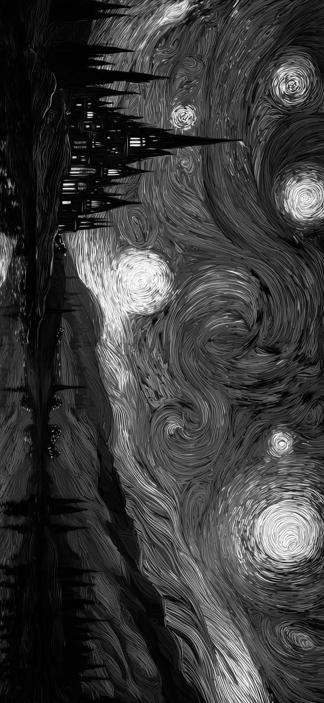
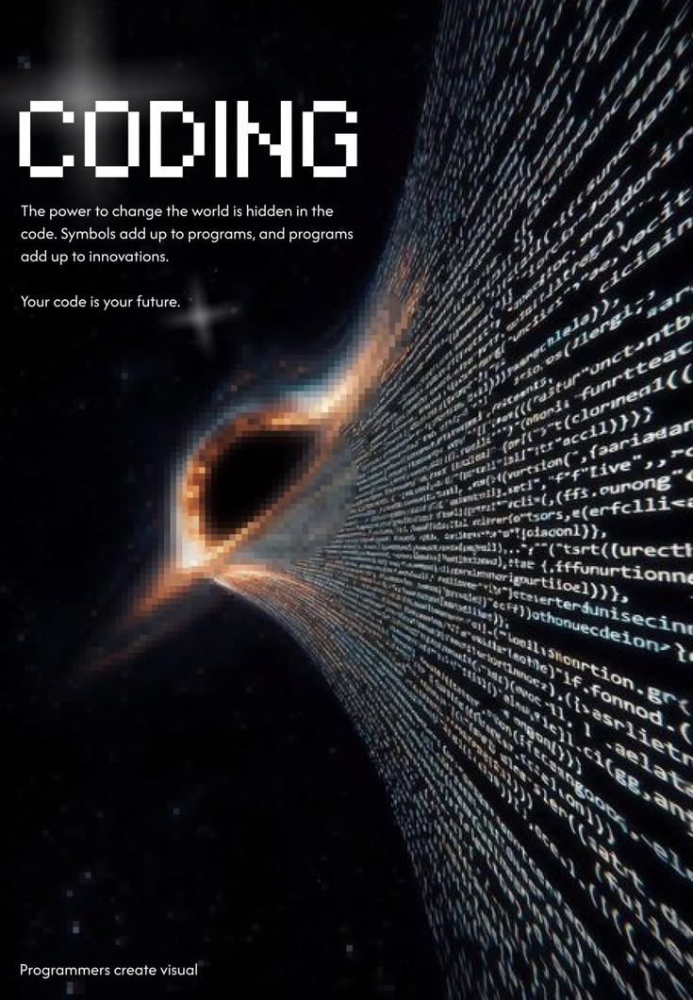
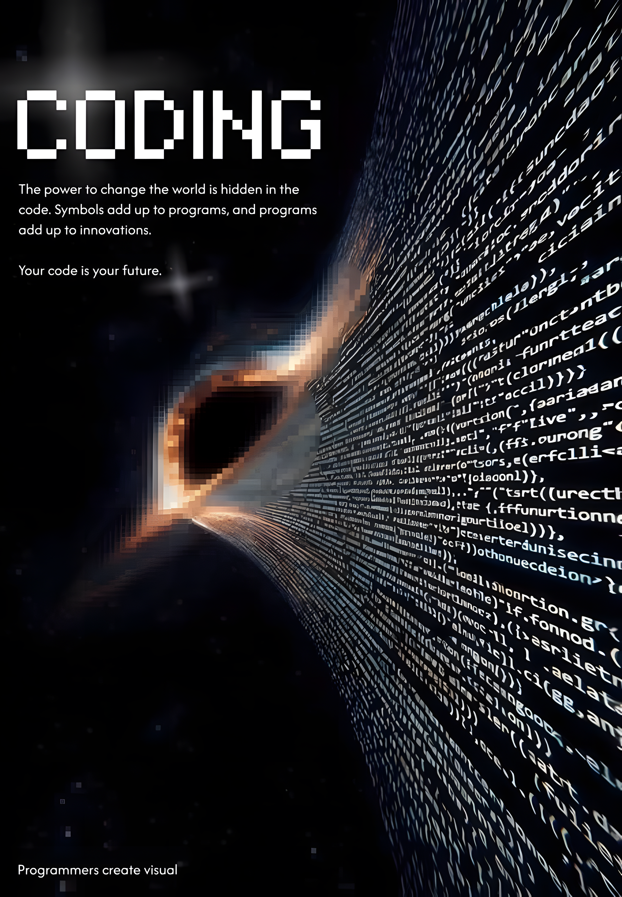

# Real-ESRGAN image highlighter

## Como usar

1. Baixe este repositório (ZIP) e extraia.
2. Arraste uma ou mais imagens para cima do arquivo `realesrgan_auto.bat`.
3. Pronto: o resultado sai na mesma pasta com sufixo `_HD`.

Exemplo de nome:

- entrada: `foto.jpg`
- saída: `foto_HD.png`

## Formatos aceitos

- `jpg`
- `jpeg`
- `png`
- `webp`
- `bmp`
- `tif`
- `tiff`

## Antes e Depois (exemplos)

Exemplos oficiais do projeto Real-ESRGAN:


<div align="center">
  <table>
    <tr>
      <td align="center">
        <b>Original (Antes)</b><br>
        
      </td>
      <td align="center">
        <b>Real-ESRGAN (Depois)</b><br>
        
      </td>
    </tr>
  </table>
</div>
<div align="center">
  <table>
    <tr>
      <td align="center">
        <b>Original (Antes)</b><br>
        
      </td>
      <td align="center">
        <b>Real-ESRGAN (Depois)</b><br>
        
      </td>
    </tr>
  </table>
</div>


## Estrutura minima do repositório

Mantenha esses arquivos exatamente assim:

```text
.
├─ realesrgan_auto.bat
├─ realesrgan-ncnn-vulkan.exe
├─ vcomp140.dll
├─ vcomp140d.dll
└─ models/
   ├─ realesrgan-x4plus.bin
   └─ realesrgan-x4plus.param
```

## Observações rápidas

- O processamento usa GPU via Vulkan.
- Se der erro de driver, atualize o driver da placa de vídeo.
- O `.bat` já está configurado para x4 automático.

## Créditos

- Projeto original: https://github.com/xinntao/Real-ESRGAN
- Executável ncnn Vulkan: https://github.com/xinntao/Real-ESRGAN-ncnn-vulkan
- Guia anime model: https://github.com/xinntao/Real-ESRGAN/blob/master/docs/anime_model.md
